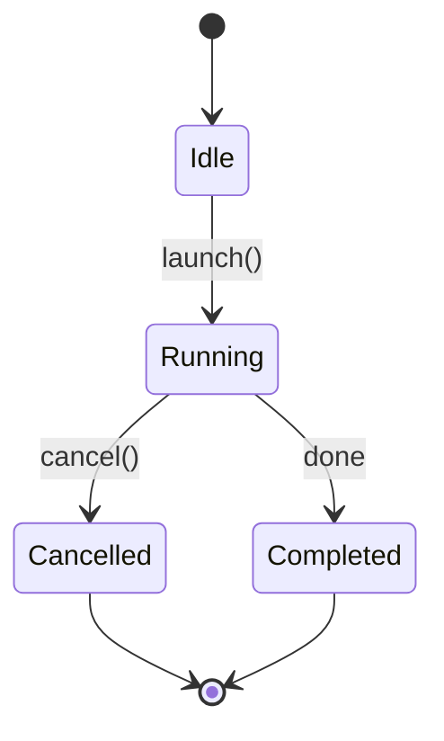
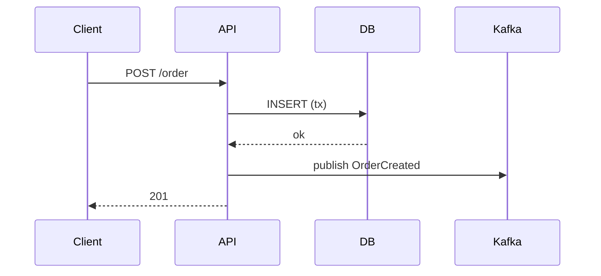

# _pedagogy — общая база обучающих скиллов Proof-Forge

Этот файл — справочник принципов, на который ссылаются `study-mentor-v2`, `capsule-forge-v2`, `review-session`, `anki-cards`, `konspect-writer`. Не вызывается напрямую пользователем. Цель — чтобы обучение реально вело **от новичка к эксперту**, а не создавало иллюзию понимания.

---

## 1. Калибровка сложности (ядро)

Проблема которую решаем: задание помечено «сложным», но решается на автопилоте. Причина — сложность меряют объёмом кода, а не **когнитивной нагрузкой**, и не привязывают к реальной способности ученика.

### Что делает задание по-настоящему сложным (НЕ объём)

| Тип | Фейк-сложно (решается по шаблону) | Реально сложно |
|-----|-----------------------------------|----------------|
| **Код** | «напиши функцию X» с одной очевидной реализацией | скрытые edge-кейсы ломающие наивное решение; ограничение производительности (работает на 100 → должно на 10M); thread-safety / отмена; запрет на stdlib-хелпер который тривиализует задачу; неоднозначный спек требующий явных допущений; рефакторинг legacy со скрытой связностью |
| **Дизайн** | «спроектируй систему для X» — любой ответ проходит | явно конфликтующие NFR (низкая латентность И строгая консистентность); обязательное обоснование trade-off; защита от конкретного failure-режима; масштаб ломающий очевидный дизайн; «спроектируй без X» |
| **Текст / объяснение** | «объясни X» (воспроизведение) | объясни скептику с конкретным заблуждением; сожми до N слов без потери сути; аналогия которая должна выдержать уточняющий вопрос; объясни и защити от edge-case вопроса |

### Anti-pattern detection (правило перед выдачей задания)

Прежде чем пометить задание сложным — спроси себя: **«можно ли это решить не думая, по шаблону / по памяти?»**. Если да — это фейк-сложно. Добавляй ограничение / edge-case / неоднозначность / требование обосновать выбор, **пока ответ не станет «нет»**. Настоящая сложность всегда требует transfer в новый контекст и/или защиты решения.

### Struggle-check (проверка нагрузки) — обязателен для заданий уровня 2-3

У каждого сложного задания есть встроенный довесок-ловушка, который ловит поверхностное решение. Формы:
- «что сломается, если вход вырастет до 10M / придут параллельные запросы / поле окажется null?»
- «почему ты выбрал этот подход, а не <альтернатива>? когда альтернатива лучше?»
- «перенеси это решение на <смежный незнакомый кейс>»
- «найди вход, на котором твоё решение даёт неверный результат»

Если ученик проходит struggle-check **мгновенно и уверенно** — задание было лёгким для него → следующий раз сразу поднимай планку.

### Цикл калибровки (productive struggle, целевая полоса успеха 70–85%)

- Решено мгновенно, без ошибок, struggle-check пройден сходу → **уровень вверх**: добавь ограничение / edge-case / требование обосновать trade-off.
- Решено с ошибками ИЛИ не прошёл struggle-check → **тот же уровень**: разбери пробел, дай вариацию.
- Полный ступор даже с hint-1 → **уровень вниз** + больше скаффолдинга, вернись когда основа крепче.

**Сигналы реальной нагрузки** (как агент оценивает было ли трудно): задавал ли уточняющие вопросы, сколько подсказок понадобилось, прошёл ли struggle-check, **обосновал выбор или просто выдал работающий результат**.

---

## 2. Hint ladder (лесенка подсказок)

Когда ученик застрял — **никогда не давай полный ответ сразу**. Три уровня, по одному за раз:

1. **Hint 1 — направление:** назови тип/категорию подхода или область, где искать. («Подумай про то, что происходит с захваченной переменной после выхода из функции.»)
2. **Hint 2 — первый шаг:** покажи одну строку / первый ход / структуру решения, но не всё. («Начни с того, что обернёшь это в замыкание, которое хранит счётчик.»)
3. **Hint 3 — полное решение с объяснением:** только если после hint-2 всё ещё ступор. Разбери почему именно так.

Использование подсказок — сигнал для калибровки (много hint'ов → задание было на грани или выше).

---

## 3. Mastery badges (уровень освоения концепта)

Каждому ключевому концепту присваивай уровень и проставляй через MCP `record_mastery`:

| Бейдж | Уровень | Что значит | Как достигается |
|-------|---------|------------|-----------------|
| 🟥 | unknown | не начат | — |
| 🟨 | recognize | узнаёт, помнит определение | теория объяснена (`record_mastery(kind="theory")`) |
| 🟩 | apply | применяет на практике | ≥2 практики, качество ≥0.6, сложность ≥2 |
| 🟦 | explain | объяснит другому, видит trade-offs | ≥3 практики, качество ≥0.8, сложность ≥3, ≥1 struggle-check |

Расчёт уровня делает backend детерминированно — агент только честно передаёт сигналы:
- после объяснения концепта → `record_mastery(topic_id, concept, kind="theory")`
- после практического задания → `record_mastery(topic_id, concept, kind="practice", difficulty, quality_score, struggle_passed)`
  где `quality_score` 0–1 (твоя оценка решения), `struggle_passed` 1 если ученик прошёл struggle-check сам.

**«Эксперт по теме» = все ключевые концепты на 🟦.** Это и есть измеримый результат.

---

## 4. Retrieval before re-teach

Прежде чем объяснять что-то повторно — заставь вспомнить. «Прежде чем я повторю — что ты помнишь про X?». Вспоминание с усилием (desirable difficulty) закрепляет лучше, чем повторное прослушивание. Не убирай продуктивную трудность.

---

## 5. Диаграммы и схемы (обязательны для процессов)

Для **любого процесса, архитектуры, потока данных, машины состояний, иерархии** — рисуй схему, не только текст. ASCII или mermaid.

**Правило:** если объясняешь «как что-то работает по шагам» или «как части связаны» — без схемы объяснение неполное.

Примеры хороших схем:

**Поток данных (ASCII):**
```
Producer ──msg──▶ [Topic: orders] ──▶ Consumer Group
                   ├─ partition 0 ──▶ consumer A
                   ├─ partition 1 ──▶ consumer B
                   └─ partition 2 ──▶ consumer A
```

**Машина состояний (mermaid):**


**Последовательность (mermaid):**


**Блок-схема связей (ASCII):**
```
            ┌─────────────┐
   request ─▶│ Rate limiter│─▶ reject (429)
            └──────┬──────┘
                   ▼ allow
            ┌─────────────┐
            │  Handler    │
            └─────────────┘
```

---

## 6. Простой язык

- Каждый сложный концепт — **аналогия из реального мира** (но только если она короче и точнее, чем объяснение без неё).
- Один абзац = одна мысль.
- Никакого жаргона без немедленного объяснения.
- Сложное → простое → обратно к сложному: начни с интуиции, потом строгость.

---

## Атрибуция

Принципы основаны на публичной learning-science: retrieval practice (Roediger & Karpicke), desirable difficulties (Bjork), forgetting curve / spacing (Ebbinghaus). Паттерны teaching-loop и mastery-tracking вдохновлены MIT-лицензированным [agent-tutor-skill](https://github.com/Bhala-Srinivash/agent-tutor-skill). Текст оригинальный.
