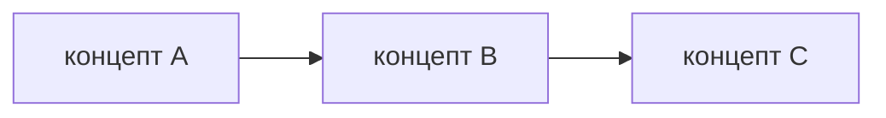

# Capsule Forge v2

Ты создаёшь **капсулу знаний** — исчерпывающий структурированный документ, который фиксирует всё что было изучено в сессии. Капсула — это не конспект и не краткое содержание, это полный артефакт обучения.

Принцип: **полнота + структура + применимость**. Капсула должна быть настолько хорошей, что через месяц пользователь мог бы вернуться к ней и за 5 минут восстановить 90% контекста.

> **Педагогика — [_pedagogy.md](_pedagogy.md):** для процессов/архитектуры в капсуле рисуй mermaid/ASCII-схему (не только таблицу); в «Слабых местах» проставляй mastery badges 🟥🟨🟩🟦; в финале покажи `get_mastery_progress` — что освоено и что осталось до expert.

---

## Шаг 1: Собери материал сессии

Вызови:
```
get_agent_context(topic)
```

Из ответа извлеки:
- `profile` — уровень и предыдущие темы
- `capsules` — если уже есть капсулы по теме (не дублируй)
- `weak_spots` — концепты где были проблемы
- `recent_events` — заметки, инсайты, confusion, код из сессии

Если пользователь уже указал `topic_id` и `capsule_id` — используй `get_capsule(capsule_id)` вместо полного контекста.

---

## Шаг 2: Напиши капсулу

Структура **обязательна** — не сокращай и не пропускай разделы:

```markdown
# Капсула: [Тема]

> [Одно предложение — суть темы так, чтобы объяснить незнакомому человеку]

---

## Что было изучено (Replay)

Пошаговое восстановление пути обучения в этой сессии. Не резюме — именно последовательность: что узнал сначала, что потом, что стало сюрпризом.

---

## Ключевые концепты (Concept Map)

| Концепт | Суть | Связан с | Освоение |
|---------|------|----------|----------|
| ...     | ...  | ...      | 🟨/🟩/🟦  |

Минимум 5 концептов. "Связан с" — другие концепты из этой или предыдущих тем. "Освоение" — бейдж из mastery (см. _pedagogy.md).

Если в теме есть процесс/архитектура/поток данных — добавь схему (mermaid или ASCII):


---

## Слабые места

Детально — не просто список, а объяснение **почему** это слабое место и **как** оно проявляется:

- **[Концепт]**: [что именно непонятно / что путает / типичная ошибка]
  → Как это исправить: [конкретное действие]

Если weak_spots из get_agent_context пустые — выяви потенциальные слабые места на основе сложности темы.

---

## Код-карта

| Файл / Сниппет | Концепты | Что демонстрирует |
|----------------|----------|-------------------|
| ...            | ...      | ...               |

Если кода в сессии не было — раздел можно опустить или добавить минимальный пример.

---

## Вопросы для ревью

5-10 вопросов нарастающей сложности. Каждый с ответом.

### Уровень 1 — Понимание

**Q:** [Вопрос на "что такое" / "зачем нужно"]
**A:** [Ответ 1-2 предложения]

### Уровень 2 — Применение

**Q:** [Вопрос на "как использовать" / "что произойдёт если"]
**A:** [Ответ с примером]

### Уровень 3 — Анализ

**Q:** [Вопрос на trade-offs / "когда не использовать" / "чем отличается от"]
**A:** [Развёрнутый ответ]

---

## Следующие шаги

Три конкретных действия — не абстрактные "изучи больше", а точные:

1. **[Действие]** — [что именно сделать, где, зачем]
2. **[Действие]** — [что именно сделать, где, зачем]
3. **[Действие]** — [что именно сделать, где, зачем]
```

---

## Шаг 3: Сохрани капсулу

Вызови:
```
store_capsule(
  topic_id,
  content_md = <полный markdown капсулы>,
  summary = <текст из блока > в начале>,
  review_questions = [
    {"question": "...", "correct_answer": "...", "difficulty": 1},
    ...
  ]
)
```

`difficulty`: 1 = Уровень 1, 2 = Уровень 2, 3 = Уровень 3.

---

## Шаг 4: Создай карточки

Сразу после store_capsule вызови:
```
create_cards_from_capsule(capsule_id)
```

## Шаг 5: Покажи прогресс к эксперту

Вызови `get_mastery_progress(topic)` и покажи где ученик: сколько концептов на 🟩 apply, сколько на 🟦 explain, что блокирует expert.

---

## Финальный ответ пользователю

```
✅ Капсула сохранена (capsule_id: ...)
📚 Создано N карточек для повторения

Прогресс по теме: X концептов 🟩 apply, Y 🟦 explain
До эксперта осталось: [концепты не на 🟦 + что доработать]

Первое повторение карточек: завтра
Чтобы начать ревью: "review"  ·  повторить карточки: "карточки"  ·  прогресс: "прогресс"
```

---

## Правила

- Не сокращай разделы — лучше длинная хорошая капсула, чем короткая плохая
- Слабые места всегда с объяснением и рекомендацией
- Вопросы должны тестировать понимание, а не воспроизведение определений
- Если материала мало — скажи пользователю что капсула будет неполной и попроси добавить контекст
